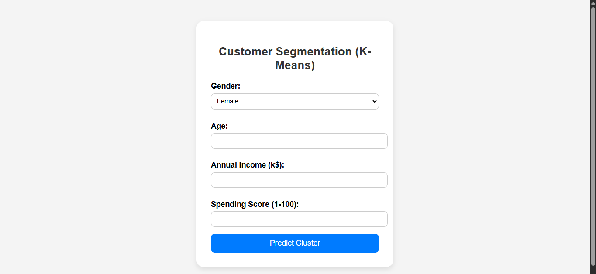
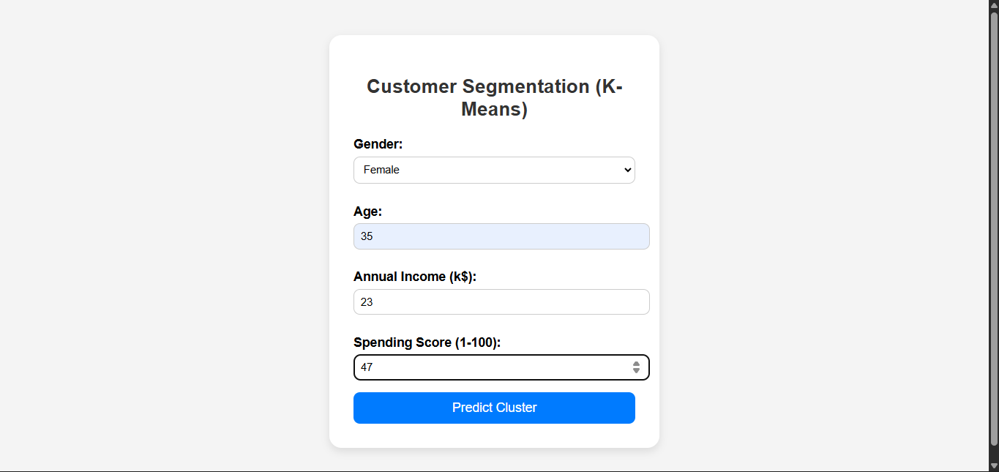
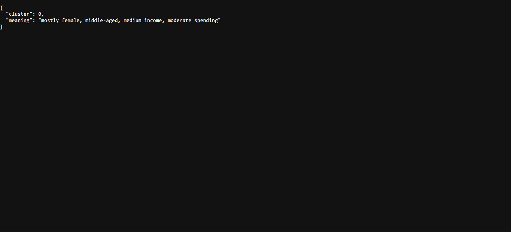

# Mall Customers Segmentation using K-Means

## Project Overview
This project performs customer segmentation using the **K-Means Clustering** algorithm on the Mall Customers dataset. 
The dataset contains demographic and spending-related information about customers, and the model groups them into different clusters based on similarities in their profiles.

---

## Dataset Information
The dataset contains the following columns:
- **CustomerID**: Unique ID assigned to each customer
- **Gender**: Male or Female
- **Age**: Age of the customer
- **Annual Income (k$)**: Annual income in thousands of dollars
- **Spending Score (1-100)**: Score assigned by the mall based on customer spending behavior

---

## Features
- Trains a **K-Means** clustering model to group customers into segments
- Uses **Label Encoding** to handle categorical data like gender
- Frontend built with HTML and CSS for user interaction
- Flask backend for handling predictions
- Returns both the predicted cluster and a description of the cluster's characteristics

---

## Technologies Used
- Python
- Pandas
- NumPy
- scikit-learn
- Flask
- HTML, CSS

---

## How to Run
1. Clone this repository
2. Install the dependencies:
   ```bash
   pip install -r requirements.txt
   ```
3. Train the model:
   ```bash
   python model.py
   ```
4. Run the Flask app:
   ```bash
   python app.py
   ```
5. Open your browser and go to `http://127.0.0.1:5000`

---

## Screenshots
1.


2.


3.

